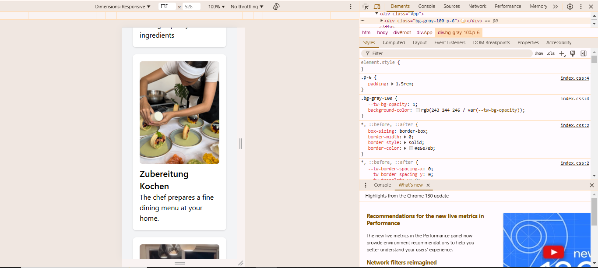
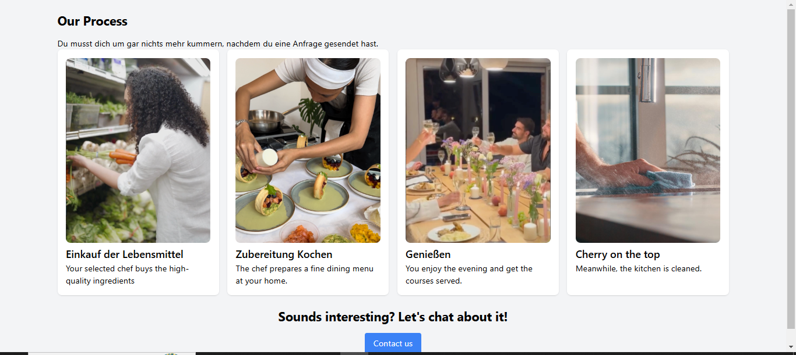

# My Landing Page

This is a simple React project that includes a landing page section using TypeScript and Tailwind CSS.

## Setup and Installation

1. **Clone the repository**:
    ```sh
    git clone <repository-url>
    cd my-landing-page
    ```

2. **Install dependencies**:
    Make sure you have Node.js installed. Then, install the necessary dependencies:
    ```sh
    npm install
    ```

3. **Configure Tailwind CSS**:
    Tailwind CSS is already configured in this project. Ensure that your `tailwind.config.js` and `index.css` are set up correctly.

## Running the Project

1. **Start the development server**:
    Start the React development server:
    ```sh
    npm start
    ```

2. **Open the application**:
    Open your browser and go to (http://localhost:3000) to see the application running.

## Project Structure

- `src/` - Contains the source code for the React components.
- `public/Assets/` - Contains the images used in the project.


### Mobile View


### Desktop View


## Customization

Feel free to customize the styles and content in the `LandingSection.tsx` component to fit your needs.

